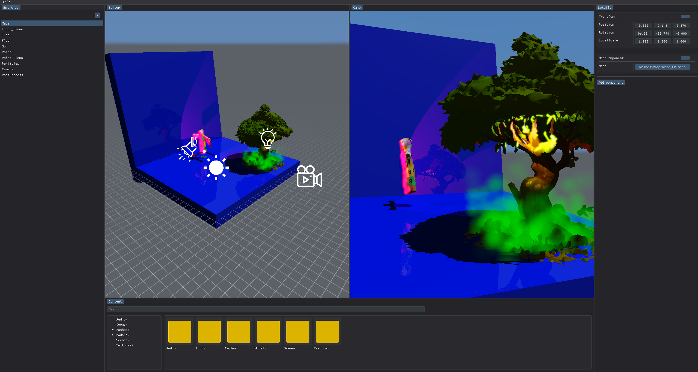

WALDEM ENGINE

Architecture:
* ECS
* Cross Render API (DirectX)
* Cross OS (Windows)
* Layers (Game, Editor, Debug)
* Editor widgets structure
* Separate game and editor structure

Renderer:
* Ray tracing
* PBR
* GBuffer
* Deferred
* Forward
* Shadow mapping
* Materials
* FFT Ocean simulation

Physics:
* AABB BVH broadphase collisions
* GJK narrowphase collisions [WIP]

Import:
* GLTF
* Image

Other:
* Logging system
* GLM math
* SDL2 window and input handling